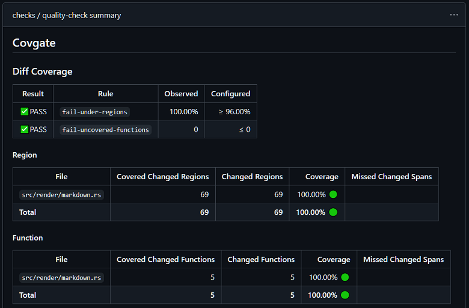

# covgate

[](https://github.com/jesse-black/covgate/actions/workflows/ci.yml)
[](https://crates.io/crates/covgate)
[](https://docs.rs/covgate)
[](./LICENSE)

Teams don’t merge a repository; they merge a diff.

Built in Rust, `covgate` is a fast quality gate CLI for local diff coverage enforcement. By parsing native coverage output, it evaluates branch, function, and region coverage rather than relying on line coverage alone. It blocks untested code from merging by gating pull requests precisely on the lines changed—running entirely locally without the delays or costs of a SaaS platform.



## The Global Gate Flaw

Standard tools establish global coverage baselines. However, relying on global gates in a CI pipeline creates a blind spot: new, untested code can "water down" the overall percentage without failing the build.

If a 10,000-line codebase has 85% global coverage, an 80% CI gate easily passes. A developer can add 200 lines of complex, untested logic, which might only drop global coverage to 83.3%. The untested code merges, and your quality slowly bleeds away.

## The Value of Diff Coverage Gates

A diff coverage tool isolates the exact lines you modified and calculates coverage only against that change.

* **The Ratchet Effect:** An 80% diff coverage requirement enforces that every new PR meets the standard, guaranteeing your global coverage stays flat or increases over time.
* **Refactoring Safety:** Deleting old, tested code drops your global percentage but doesn't affect your diff. You can clean up technical debt without failing the build.
* **Actionable Feedback:** Failing a build over a 0.3% global drop is abstract. Failing because "the 15 lines added in `auth.rs` lack test coverage" is immediate and localized.

## The "Lossless-First" Philosophy

Most tools use formats like Cobertura or LCOV, which flatten complex compiler data into line-oriented text. This leads to "ghost branches" and imprecise gating.

`covgate` reads JSON directly from the compiler (like `llvm-cov`). No middleman, no lost detail.

## Cloud Agent Feedback Loop

Cloud-based AI agents (like Google Jules or Codex Cloud) often work in isolated sandboxes with shallow checkouts. Because the base branch (like `main`) is missing from the environment, standard diff tools fail.

`covgate` solves this with `record-base`. By capturing a stable "before" snapshot at the start of a task, it allows Cloud Agents to run a local gate check before they even push a commit. 

**Note:** This is specifically for Cloud Agents. Local agents running on your machine (like Gemini CLI or Claude Code) have access to your full Git history and don't require this step.

## Supported Ecosystems

* **Rust:** Region-aware gating from `llvm-cov`.
* **JavaScript / TypeScript:** Line and branch gating from Istanbul JSON.
* **C# / .NET:** Line and branch gating from Coverlet JSON.

## Installation

`covgate` is a standalone binary with no runtime dependencies.

```bash
cargo install covgate
```

## Usage

Run `covgate` in your CI pipeline after your tests generate coverage artifacts. Invoke it with either a Git base reference or a diff file.

### CLI Surface

`check <coverage-report>` runs coverage checks for the provided report.
Options:
- `--base <REF>` selects the Git base reference to diff against.
- `--diff-file <FILE>` uses a precomputed unified diff instead of Git base discovery.
- `--fail-under-regions <PERCENT>` fails if changed-region coverage is below this threshold.
- `--fail-under-lines <PERCENT>` fails if changed-line coverage is below this threshold.
- `--fail-under-branches <PERCENT>` fails if changed-branch coverage is below this threshold.
- `--fail-under-functions <PERCENT>` fails if changed-function coverage is below this threshold.
- `--fail-uncovered-regions <MAX>` fails if the raw count of uncovered regions exceeds this limit.
- `--fail-uncovered-lines <MAX>` fails if the raw count of uncovered lines exceeds this limit.
- `--fail-uncovered-branches <MAX>` fails if the raw count of uncovered branches exceeds this limit.
- `--fail-uncovered-functions <MAX>` fails if the raw count of uncovered functions exceeds this limit.
- `--markdown-output <FILE>` writes a Markdown summary for CI interfaces like GitHub Actions.

`record-base` captures a stable task-start base when normal branch refs are unavailable.

### Gating a Pull Request Locally

```bash
# Generate JSON coverage report
cargo llvm-cov --json --output-path coverage.json

# Run covgate against the origin/main branch, failing if region coverage is below 80%
covgate check coverage.json --base origin/main --fail-under-regions 80
```

### Standard Checkout Workflow

In a standard checkout, the normal workflow is simply `covgate check <coverage-report>`. If `--base` is omitted, `covgate` automatically checks `origin/HEAD`, `origin/main`, `origin/master`, `main`, and `master`. No `record-base` step is needed in that case.

When diffing against a Git base, `covgate` compares the merge-base snapshot to your current worktree. This includes committed changes plus staged/unstaged tracked edits, so local diagnosis reflects in-progress work.

```bash
# Generate JSON coverage report
cargo llvm-cov --json --output-path coverage.json

# Let covgate auto-discover the base ref in a standard checkout
covgate check coverage.json --fail-under-lines 90 --fail-under-regions 85
```

If your team wants a non-default base, pass it explicitly:

```bash
covgate check coverage.json --base origin/main --fail-under-regions 80
```

### Cloud-Agent Workflow

Use `covgate record-base` only in constrained Cloud Agent sandboxes (like Google Jules or Codex Cloud) where normal base branches such as `main` or `origin/main` are unavailable due to shallow checkouts.

Run `covgate record-base` at the beginning of a task before the agent makes Git changes. Running it immediately before `covgate check` is too late because that would capture the post-change `HEAD` instead of the task-start base.

When `--base` is omitted, `covgate` first tries the standard branch refs listed above and only falls back to `refs/worktree/covgate/base` when those refs are unavailable. Explicit `--base` still takes precedence. If a default base branch ref is already available, `covgate record-base` will do nothing.

The recorded base is kept per branch so separate agent task branches keep separate stable diff anchors.

```bash
# Capture a stable base commit at task start
covgate record-base

# ...agent performs the task work...

# Generate coverage and gate locally against the recorded base
cargo llvm-cov --json --output-path coverage.json
covgate check coverage.json --fail-under-lines 90 --fail-under-regions 85
```

The Codex Cloud environment settings maintenance script should include `covgate record-base` so coverage checks can validate the task reliably. Jules does not have a maintenance-script setting, so instructions for Jules should require running `covgate record-base` before every task.

### Configuration (`covgate.toml`)

`covgate` reads repository-local defaults from `covgate.toml` so teams can keep their configuration checked in with the code. CLI flags always override config values.

You can specify a default `base` and `markdown_output` at the top level, along with minimum percentage (`fail_under_*`) and maximum uncovered count (`fail_uncovered_*`) rules under `[gates]`.

```toml
# Set a default comparison base and output file
base = "origin/main"
markdown_output = "summary.md"

[gates]
# Percentage-based gates (fail if coverage percentage is less than this value)
fail_under_lines = 90
fail_under_regions = 85
fail_under_branches = 80

# Raw count gates (fail if the count is greater than this value)
fail_uncovered_functions = 0
```

With `covgate.toml` checked in, local invocations become frictionless:

```bash
# Run covgate using the thresholds and base defined in covgate.toml
covgate check coverage.json
```

## GitHub Actions

Generate JSON coverage, run `covgate`, and seamlessly write the results to your PR summary. 

We recommend [taiki-e/install-action](https://github.com/taiki-e/install-action) for installation in actions.

When running `covgate` against the default branch in GitHub Actions, set `fetch-depth: 0` on the checkout action so it includes the default branch as the base to diff against. This is not required when using `--diff-file`.

```yaml
- uses: actions/checkout@v6
  with:
    fetch-depth: 0

- name: Install covgate
  uses: taiki-e/install-action@covgate

- name: Generate Coverage
  run: cargo llvm-cov --json --output-path coverage.json

- name: Gate Pull Request
  run: covgate check coverage.json --markdown-output "$GITHUB_STEP_SUMMARY"
```

## How does `covgate` compare to existing tools?

* **Hosted SaaS (Codecov, Sonar):** These are great for dashboards, but they are slow for PR feedback and require sending your code to a third party. They also carry significant subscription costs for closed-source projects. `covgate` is local, private, and instant.
* **Local Diff Tools (`diff-cover`):** We were inspired by [`diff-cover`](https://github.com/Bachmann1234/diff_cover), but wanted a tool that could gate on branches, functions, and regions rather than just lines. `covgate` also solves the "missing base branch" problem in Cloud Agent environments (like Jules and Codex Cloud) where shallow checkouts make standard diffing impossible.

## Contributing

Contributions are welcome. If your ecosystem has a native JSON or similarly lossless coverage format that maps accurately to executable structure, that is the exact kind of integration `covgate` is meant to support.

## License

Apache 2.0. See [LICENSE](./LICENSE) for details.
