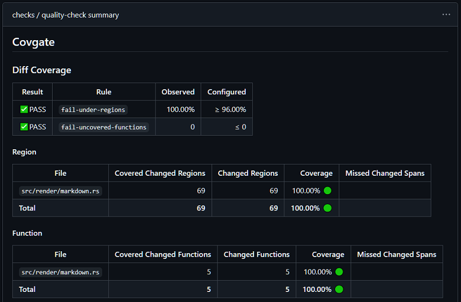

# covgate

[](https://github.com/jesse-black/covgate/actions/workflows/ci.yml)
[](https://crates.io/crates/covgate)
[](./LICENSE)

Teams don’t merge a repository; they merge a diff.

`covgate` is a fast Rust CLI for local diff coverage enforcement. By parsing native coverage output, it evaluates branch, function, and region coverage rather than relying on line coverage alone. It blocks untested code from merging by gating pull requests precisely on the lines changed—running entirely locally without the delays or costs of a SaaS platform.



## The Global Gate Flaw

Standard tools establish global coverage baselines. However, relying on global gates in a CI pipeline creates a blind spot: new, untested code can "water down" the overall percentage without failing the build.

If a 10,000-line codebase has 85% global coverage, an 80% CI gate easily passes. A developer can add 200 lines of complex, untested logic, which might only drop global coverage to 83.3%. The untested code merges, and your quality slowly bleeds away.

## The Value of Diff Coverage Gates

A diff coverage tool isolates the exact lines you modified and calculates coverage only against that change.

* **The Ratchet Effect:** An 80% diff coverage requirement enforces that every new PR meets the standard, guaranteeing your global coverage stays flat or increases over time.
* **Refactoring Safety:** Deleting old, tested code drops your global percentage but doesn't affect your diff. You can clean up technical debt without failing the build.
* **Actionable Feedback:** Failing a build over a 0.3% global drop is abstract. Failing because "the 15 lines added in `auth.rs` lack test coverage" is immediate and localized.

## The "Lossless-First" Philosophy

Most tools use formats like Cobertura or LCOV, which flatten complex compiler data into line-oriented text. This leads to "ghost branches" and imprecise gating.

`covgate` reads JSON directly from the compiler (like `llvm-cov`). No middleman, no lost detail.

## Cloud Agent Feedback Loop

Cloud-based AI agents (like Google Jules or Codex Cloud) often work in isolated sandboxes with shallow checkouts. Because the base branch (like `main`) is missing from the environment, standard diff tools fail.

`covgate` solves this with `record-base`. By capturing a "before" snapshot at the start of a task, it allows cloud agents to run a local gate check before they even push a commit. 

> [!NOTE]
> `record-base` is only needed in cloud agent sandboxes. Local agents running on a full checkout, such as Gemini CLI or Claude Code, already have access to Git history and can use the standard workflow.

## Supported Ecosystems

* **Rust:** Region-aware gating from `llvm-cov`.
* **JavaScript / TypeScript:** Line and branch gating from Istanbul JSON.
* **C# / .NET:** Line and branch gating from Coverlet JSON.

## Installation

`covgate` is a standalone binary with no runtime dependencies.

```bash
cargo install covgate
```

## Usage

Define your coverage policy in `covgate.toml`, check it in alongside your code, and every contributor and CI job enforces the same thresholds automatically.

```toml
[[gates]]
fail-under-lines = 90
fail-under-branches = 80
```

Then run `covgate` after generating your coverage report:

```bash
cargo llvm-cov --json --output-path coverage.json
covgate check coverage.json
```

### Path-Scoped Gates

Coverage gates should protect the code where coverage is a good signal. In a React app, `.ts` logic often reaches strict line and branch gates cleanly, while `.tsx` components can turn the last few branch points into brittle render tests that slow down refactors. Path-scoped gates let those files follow different rules: stricter for logic, more pragmatic for UI.

```toml
# Stricter rules for logic
[[gates]]
name = "logic"
include = "src/**/*.ts"
exclude = "src/generated/**"
fail-under-lines = 90
fail-under-branches = 80

# Relaxed gates for UI components
[[gates]]
name = "ui"
include = "src/**/*.tsx"
fail-under-lines = 80
fail-under-branches = 60

# Fallback gate for any changed files not matched above
[[gates]]
fail-under-lines = 80
```

### Available Metrics

`covgate` can gate on the metrics exposed by the coverage format being checked.

| Metric | What it gates | Notes |
|---|---|---|
| `lines` | Changed lines executed by tests | The most widely available coverage metric and the easiest baseline to understand. |
| `branches` | Changed control-flow outcomes exercised by tests | Available for formats that report branch coverage, such as Istanbul and Coverlet. |
| `regions` | Region coverage from `llvm-cov` | Available for Rust coverage reports. |
| `functions` | Callable coverage | Includes named functions, methods, closures, and lambdas. |
| `named-functions` | Named function and method coverage | Best when you want every function your team ships to be exercised by at least one test. |

> [!NOTE]
> Rust branch coverage through `cargo llvm-cov --branch` currently requires a nightly toolchain. For normal Rust coverage runs, `regions` provides a more precise signal by mapping granular source spans rather than treating each line as a single covered-or-uncovered unit.

### Standard Checkout Workflow

If `--base` is omitted, `covgate` automatically checks `origin/HEAD`, `origin/main`, `origin/master`, `main`, and `master` in order. No `record-base` step is needed.

When diffing against a Git base, `covgate` compares the merge-base snapshot to your current worktree. This includes committed changes plus staged/unstaged tracked edits, so local diagnosis reflects in-progress work.

```bash
cargo llvm-cov --json --output-path coverage.json
covgate check coverage.json
```

If your team uses a non-default base branch, set it in `covgate.toml` or pass it explicitly:

```bash
covgate check coverage.json --base origin/develop
```

### Cloud-Agent Workflow

Use `covgate record-base` only in cloud agent sandboxes, such as Google Jules or Codex Cloud, where default branch refs like `main` or `origin/main` may be unavailable because of shallow checkouts.

Run `covgate record-base` at the beginning of a task before the agent makes Git changes. Running it immediately before `covgate check` is too late because that would capture the post-change `HEAD` instead of the task-start base.

When `--base` is omitted, `covgate` first tries the standard branch refs listed above and only falls back to `refs/worktree/covgate/base` when those refs are unavailable. Explicit `--base` still takes precedence. If a default base branch ref is already available, `covgate record-base` will do nothing.

The recorded base is kept per branch so separate agent task branches keep separate diff anchors.

```bash
# Capture the base commit at task start
covgate record-base

# ...agent performs the task work...

# Generate coverage and gate locally against the recorded base
cargo llvm-cov --json --output-path coverage.json
covgate check coverage.json
```

The Codex Cloud environment settings maintenance script should include `covgate record-base` so coverage checks can validate the task reliably. Jules does not have a maintenance-script setting, so instructions for Jules should require running `covgate record-base` before every task.

## GitHub Actions

Generate JSON coverage, run `covgate`, and seamlessly write the results to your PR summary. 

We recommend [taiki-e/install-action](https://github.com/taiki-e/install-action) for installation in actions.

When running `covgate` against the default branch in GitHub Actions, set `fetch-depth: 0` on the checkout action so it includes the default branch as the base to diff against. This is not required when using `--diff-file`.

```yaml
- uses: actions/checkout@v6
  with:
    fetch-depth: 0

- name: Install covgate
  uses: taiki-e/install-action@covgate

- name: Generate Coverage
  run: cargo llvm-cov --json --output-path coverage.json

- name: Gate Pull Request
  run: covgate check coverage.json
```

## How does `covgate` compare to existing tools?

* **Hosted SaaS (Codecov, Sonar):** These are great for dashboards, but they are slow for PR feedback and require sending your code to a third party. They also carry significant subscription costs for closed-source projects. `covgate` is local, private, and instant.
* **Local Diff Tools (`diff-cover`):** We were inspired by [`diff-cover`](https://github.com/Bachmann1234/diff_cover), but wanted a tool that could gate on branches, functions, and regions rather than just lines. `covgate` also solves the "missing base branch" problem in Cloud Agent environments (like Jules and Codex Cloud) where shallow checkouts make standard diffing impossible.

## Contributing

Contributions are welcome. If your ecosystem has a native JSON or similarly lossless coverage format that maps accurately to executable structure, that is the exact kind of integration `covgate` is meant to support.

## License

Apache 2.0. See [LICENSE](./LICENSE) for details.
